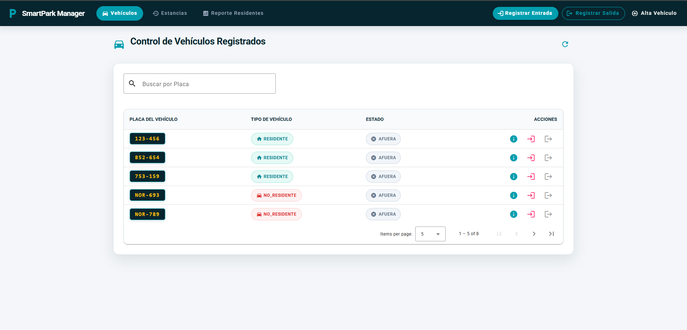
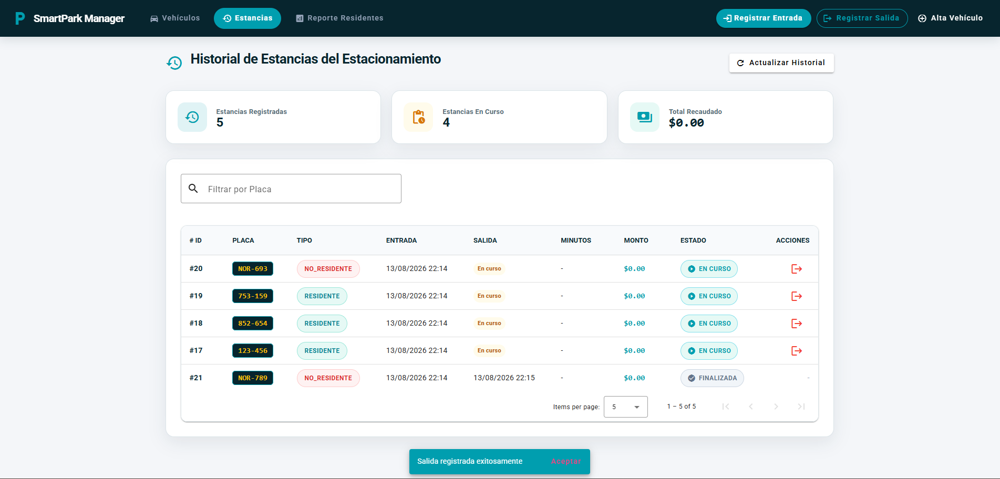
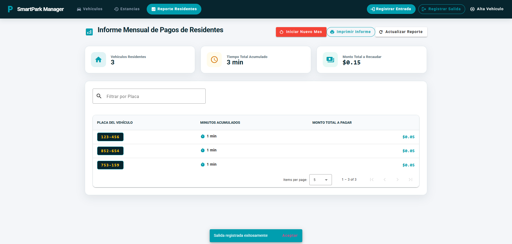
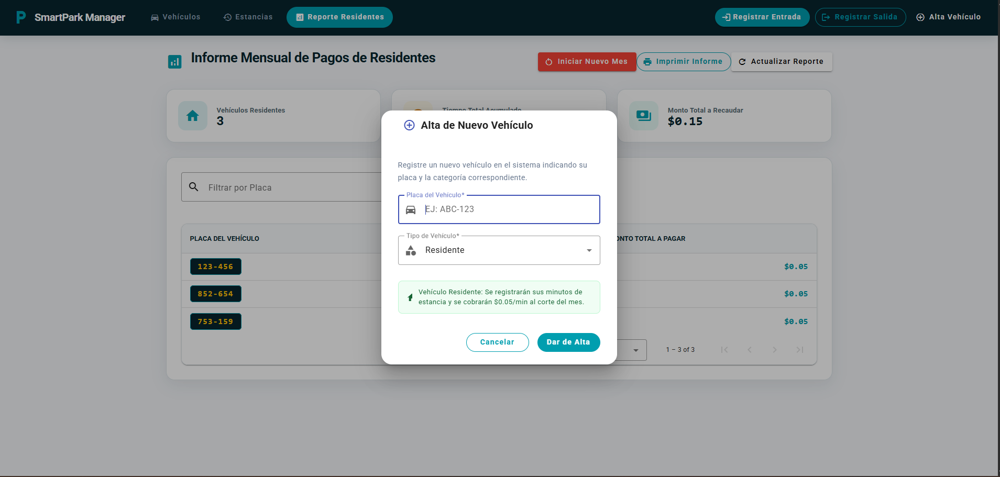
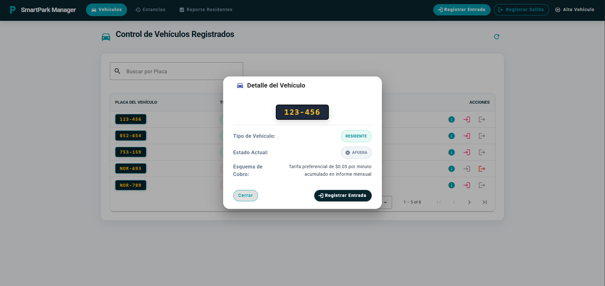
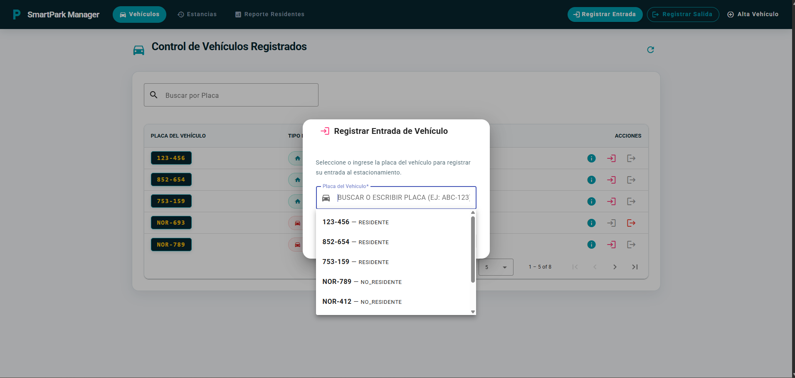
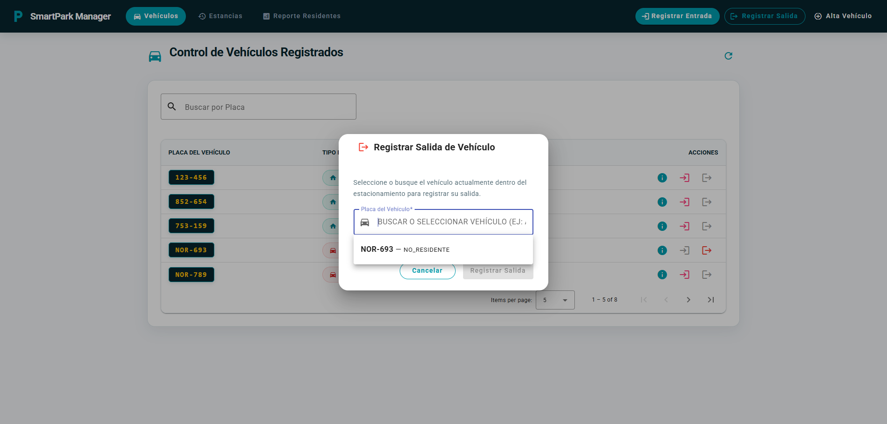
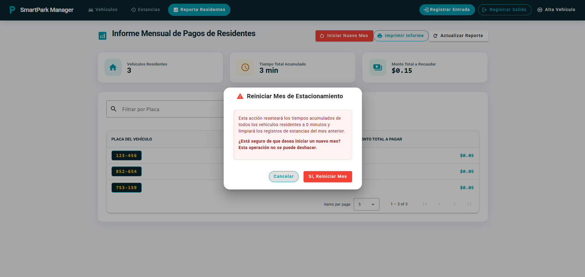
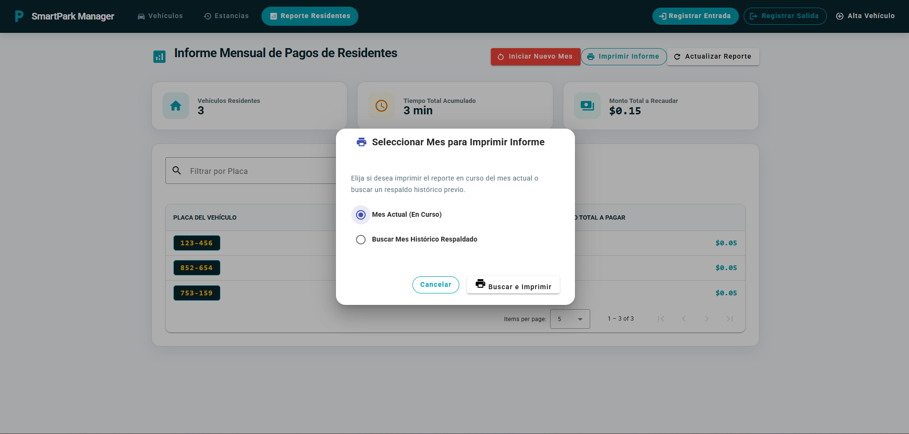

# 🚗 Sistema de Control de Estacionamiento - Frontend

Aplicación web desarrollada en **Angular 16** y **Angular Material** para la gestión integral de un estacionamiento. Permite administrar vehículos registrados (Oficiales, Residentes y No Residentes), controlar las estancias (entradas y salidas), calcular automáticamente cobros acumulados o tarifas por minuto, y generar reportes mensuales de cobro para residentes.

---

## 🛠️ Tecnologías y Versiones Utilizadas

A continuación se detallan los frameworks, librerías y herramientas utilizadas en el desarrollo del proyecto:

| Tecnología / Herramienta | Versión Utilizada | Descripción |
| :--- | :---: | :--- |
| **Angular CLI** | `16.0.4` | Herramienta de línea de comandos para Angular |
| **Angular Core / Framework** | `16.0.0` | Framework principal de desarrollo web |
| **Angular Material / CDK** | `16.2.14` | Componentes de diseño e interfaz UI |
| **TypeScript** | `5.0.2` | Lenguaje tipado para JavaScript |
| **RxJS** | `7.8.0` | Librería para programación reactiva |
| **Zone.js** | `0.13.0` | Manejo de zonas y detección de cambios |
| **Jasmine** | `4.6.0` | Framework para pruebas unitarias |
| **Karma** | `6.4.0` | Ejecutor de pruebas en el navegador |
| **Node.js** (Recomendado) | `>= 18.x` | Entorno de ejecución JavaScript |

---

## 📁 Estructura de Carpetas del Proyecto

El proyecto sigue una arquitectura modular y organizada por responsabilidades en Angular:

```text
estacionamiento-frontend/
├── src/
│   ├── app/
│   │   ├── components/                           # Componentes UI (Vistas principales y Modales)
│   │   │   ├── alta-vehiculo/                    # Modal para registrar/editar vehículos
│   │   │   ├── estancia-list/                    # Vista principal de Control de Estancias
│   │   │   ├── iniciar-mes/                      # Modal de confirmación para reiniciar mes fiscal
│   │   │   ├── navbar/                           # Barra superior de navegación global
│   │   │   ├── registrar-entrada/                # Modal para registrar el ingreso de vehículos
│   │   │   ├── registrar-salida/                 # Modal para registrar la salida y cobro de vehículos
│   │   │   ├── reporte-residentes/               # Vista de Reporte Mensual de pagos a residentes
│   │   │   ├── seleccionar-mes-impresion-dialog/ # Modal para elegir mes/año a imprimir
│   │   │   ├── vehiculo-detail/                  # Modal con información detallada e historial
│   │   │   └── vehiculo-list/                    # Vista principal de Gestión de Vehículos
│   │   ├── models/                               # Interfaces TypeScript y Modelos DTO
│   │   │   └── estacionamiento.models.ts
│   │   ├── services/                             # Servicios de consumo HTTP API REST
│   │   │   ├── estacionamiento.service.ts
│   │   │   └── estacionamiento.service.spec.ts
│   │   ├── app-routing.module.ts                 # Definición de rutas principales
│   │   ├── app.component.html / .ts / .scss      # Componente raíz de la aplicación
│   │   └── app.module.ts                         # Módulo principal con declaraciones e imports
│   ├── assets/                                   # Recursos estáticos e imágenes
│   ├── styles/                                   # Hojas de estilo SCSS globales y temas
│   ├── favicon.ico                               # Icono de la aplicación
│   ├── index.html                                # HTML principal
│   ├── main.ts                                   # Punto de entrada de Angular
│   └── styles.scss                               # Estilos globales y reglas de reseteo
├── angular.json                                  # Configuración de build de Angular CLI
├── package.json                                  # Definición de scripts y dependencias
├── tsconfig.json                                 # Configuración del compilador TypeScript
└── README.md                                     # Documentación del proyecto
```

---

## 🖥️ Descripción de Pantallas y Modales

### 1. 🚘 Gestión y Listado de Vehículos
- **Ruta:** `/vehiculos`
- **Descripción:** Vista principal donde se administra el padrón de vehículos. Permite visualizar una tabla interactiva con la lista de vehículos (placa y tipo: *Oficial*, *Residente* o *No Residente*), filtrar o buscar por placa, y realizar acciones como registrar un nuevo vehículo, consultar el detalle e historial de estancias, o eliminar registros.
- **Acciones Disponibles:**
  - ➕ **Registrar Vehículo**: Abre el modal de alta de vehículo.
  - 🔍 **Búsqueda / Filtro**: Filtrado en tiempo real por número de placa.
  - 👁️ **Ver Detalle**: Abre el modal con el historial completo de estancias del vehículo.
  - 🗑️ **Eliminar**: Elimina el registro del vehículo del sistema.

#### 📸 Captura de Pantalla


---

### 2. ⏱️ Control de Estancias (Entradas y Salidas)
- **Ruta:** `/estancias`
- **Descripción:** Módulo para el control operativo del estacionamiento en tiempo real. Permite registrar las entradas de los vehículos cuando ingresan y procesar sus salidas calculando el tiempo transcurrido y la tarifa correspondiente a pagar.
- **Acciones Disponibles:**
  - 📥 **Registrar Entrada**: Permite ingresar la placa del vehículo que entra al estacionamiento.
  - 📤 **Registrar Salida**: Procesa la salida de un vehículo calculando la hora de salida y el monto a pagar según su categoría.
  - 📊 **Tabla de Estancias**: Muestra vehículos dentro del estacionamiento y estancias ya finalizadas.

#### 📸 Captura de Pantalla


---

### 3. 📄 Reporte de Pagos a Residentes
- **Ruta:** `/residentes`
- **Descripción:** Vista dedicada al cálculo de importe acumulado a pagar por los vehículos de tipo **Residente** al final del mes. Muestra el número de placa, minutos totales estacionados en el período y el monto acumulado a cobrar (a razón de $0.05 por minuto).
- **Acciones Disponibles:**
  - 🔄 **Iniciar Nuevo Mes**: Reinicia los acumulados de estancias para dar comienzo a un nuevo período fiscal.
  - 🖨️ **Imprimir Informe**: Abre la ventana de impresión o exportación PDF ajustada con diseño para reporte físico.
  - 📅 **Consulta Histórica**: Permite cambiar entre el mes actual y meses anteriores finalizados.

#### 📸 Captura de Pantalla


---

### 4. 🧩 Modales y Diálogos Interactivos

#### 🔹 Modal: Alta / Edición de Vehículo
- **Descripción:** Formulario flotante para dar de alta un nuevo vehículo o modificar su información existente (Placa y Tipo de Vehículo).

##### 📸 Captura de Pantalla


---

#### 🔹 Modal: Detalle e Historial de Vehículo
- **Descripción:** Ventana emergente que despliega el resumen del vehículo seleccionado junto con la lista detallada de todas sus entradas, salidas y minutos acumulados.

##### 📸 Captura de Pantalla


---

#### 🔹 Modal: Registrar Entrada de Vehículo
- **Descripción:** Diálogo sencillo que solicita el ingreso del número de placa para registrar la hora de entrada en el sistema.

##### 📸 Captura de Pantalla


---

#### 🔹 Modal: Registrar Salida y Liquidación
- **Descripción:** Diálogo para confirmar la salida del vehículo. Muestra la hora de ingreso, la hora de salida, los minutos consumidos y la tarifa / cobro total generado.

##### 📸 Captura de Pantalla


---

#### 🔹 Modal: Confirmación de Iniciar Nuevo Mes Fiscal
- **Descripción:** Mensaje de advertencia y confirmación previo al reinicio del acumulado mensual de vehículos residentes u oficiales.

##### 📸 Captura de Pantalla


---

#### 🔹 Modal: Seleccionar Mes para Impresión
- **Descripción:** Selector de período (mes y año) para generar e imprimir el reporte mensual consolidado de residentes.

##### 📸 Captura de Pantalla


---

## 🚀 Instalación y Ejecución Local

### Prerrequisitos
- Tener instalado **Node.js** (versión `18.x` o superior recomendada) y **npm**.
- Tener en ejecución el backend del sistema: [estacionamiento-backend](https://github.com/Tedyyy-Albur/estacionamiento-backend.git) (ejecutándose en `http://localhost:8080`).

### Pasos para ejecutar
1. **Clonar o situarse en el directorio del proyecto:**
   ```bash
   cd estacionamiento-frontend
   ```

2. **Instalar las dependencias:**
   ```bash
   npm install
   ```

3. **Iniciar el servidor de desarrollo:**
   ```bash
   npm start
   # o bien: ng serve
   ```

4. **Acceder a la aplicación:**
   Abre tu navegador e ingresa a `http://localhost:4200/`.

---

## 🧪 Pruebas Unitarias y Build

- **Ejecutar Pruebas Unitarias (Karma/Jasmine):**
  ```bash
  npm test
  ```

- **Compilar para Producción:**
  ```bash
  npm run build
  ```
  Los archivos resultantes se generarán en la carpeta `dist/estacionamiento-frontend`.

---

## 🔗 Backend del Aplicativo

> Para que el aplicativo funcione correctamente, se requiere que el servicio Backend esté desplegado y en ejecución.
>
> 📌 **Repositorio del Backend requerido:**  
> [https://github.com/Tedyyy-Albur/estacionamiento-backend.git](https://github.com/Tedyyy-Albur/estacionamiento-backend.git)
